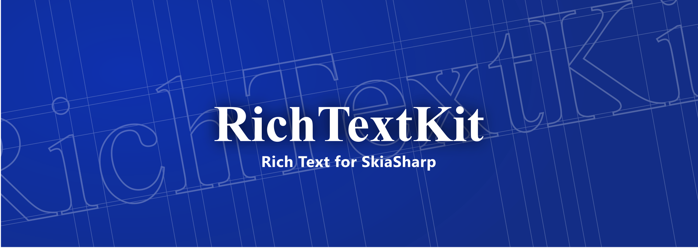
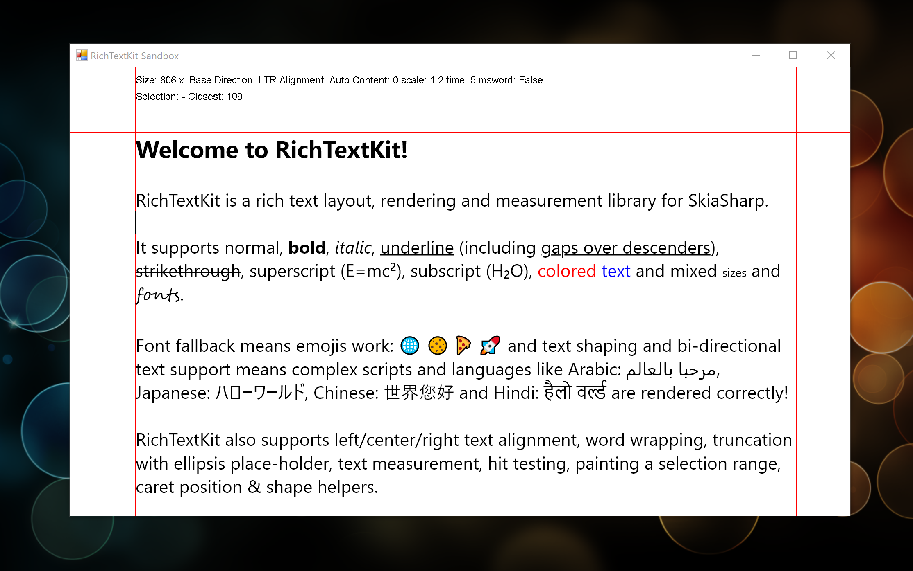

# RichTextKit

RichTextKit is a rich-text layout, measurement and rendering library for SkiaSharp.

## Features

* Rich text layout
* Supports most common font styles (bold, italic, underline, super/sub-script etc...)
* Text shaping using HarfBuzzSharp
* Font fallback for emoji and int'l character sets
* Bi-directional and LTR/RTL Text Support (UAX #9)
* Unicode word-break algorithm (UAX #14)
* Max height and max line limits
* Truncate with ellipsis support
* Text measurement support
* Hit testing and caret position information
* Ability to paint selection range highlight
* Easy to use
* Minimal dependencies (just SkiaSharp and HarfBuzzSharp)

## Under Development

RichTextKit is still under development.  It works fine on Windows under net462 and 
net5.0 but hasn't been tested on other platforms.

Also, text layout in general and Unicode and international text specifically are a 
complicated topics - almost certainly there are issues I'm unaware of and I'm 
hoping the community can help improve this project over time...

That said, RichTextKit certainly does a better job than Skia on it's own.

## Documentation

See here for [documentation](https://www.toptensoftware.com/richtextkit).